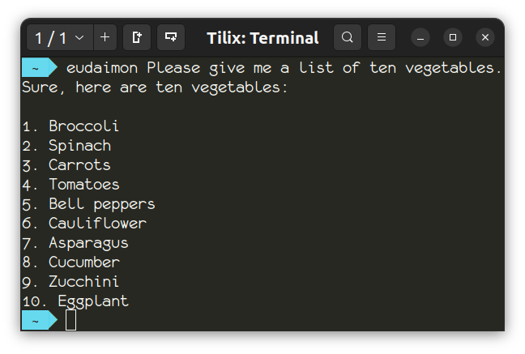
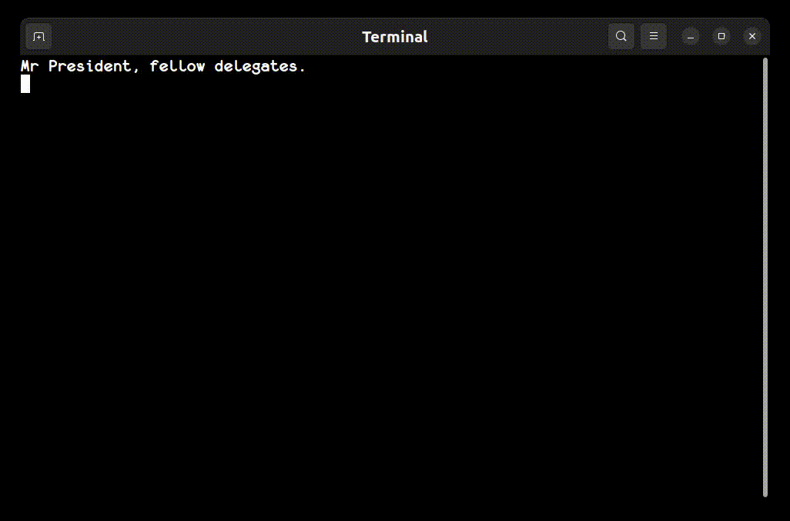

# eudaimon

## setup

```Bash
pip3 install                                 \
    numpy                                    \
    openai                                   \
    pillow                                   \
    pyaudio                                  \
    pyautogui                                \
    SpeechRecognition                        \
    torch                                    \
    git+https://github.com/openai/whisper.git
```

## eudaimon

The script `eudaimon` is a simple interface to an OpenAI model via the OpenAI API. Simply run the script `eudaimon` and any arguments following the script name are taken as text input for the model used. For this script is assumed that the environment variable `OPENAI_API_KEY` is set appropriately.



## eudaimon_transcribe

The script `eudaimon_transcribe` uses an offline Whisper model to transcribe spoken words live (and an OpenAI key is not needed). Check the script options with `eudaimon_transcribe --help`. It is assumed that the environment variable `DEFAULT_MIC` is set appropriately. Using `eudaimon_transcribe --list_microphones` may assist with setting this variable. On the first use of a selected Whisper model, it may be that the system downloads the model before transcription is possible. Press `Ctrl` + `C` to exit.

In order to avoid excessive terminal output related to system audio, it may be appropriate to run the script with shell redirection like the following:

```Bash
eudaimon_transcribe 2>/dev/null
```



## eudaimon_image

```Bash
./eudaimon_image --image=image.png --prompt="What's in this image?"
This image depicts a painting of a cat looking out of a window at a space scene. Outside the window, there is a view of a large planet that resembles Jupiter with its characteristic stripes, as well as a moon. There are also several large spaceships visible in space. In the foreground, next to the cat, there is a table with a glass of red liquid and a plate with some items on it, possibly food or snacks.
```

## eudaimon_screenshots

```Bash
./eudaimon_screenshots --prompt="Without describing the GUI or including any passcodes or secure information, what's the content in focus in this screenshot?" --interval=30
starting in 30 seconds

2024-06-10T190118395805Z.png
The content in focus is a search results page for images of cats. The screen displays numerous pictures of cats, including kittens and adult cats, in various poses. The search term used is "picture of cat," and the results include a variety of images ranging from close-ups to group shots, some looking playful, others calm, or curious.

2024-06-10T190202954486Z.png
The screenshot focuses on search results for images of dogs. Various pictures of dogs and puppies are displayed as thumbnails, each accompanied by a description and a source link. The images include a mix of different breeds and types of dogs, along with some categories for refining the search further. There are also related search suggestions visible at the beginning.
```

```Bash
./eudaimon_screenshots --prompt="Please answer the first unanswered question you see in this screenshot, and only the first question. State which question you are answering at the start of your response."
```

```Bash
./eudaimon_screenshots --prompt="\

Without including any passcodes or secure information, please describe this screenshot in a markup form like the following:

<desktop>
    <window title='Firefox' id='win1' state='focused'>
        <summary>Viewing an article on AI advancements.</summary>
    </window>
    <window title='Terminal' id='win2' state='background'>
        <summary>Editing a Python script for data analysis.</summary>
    </window>
</desktop>
"
```
